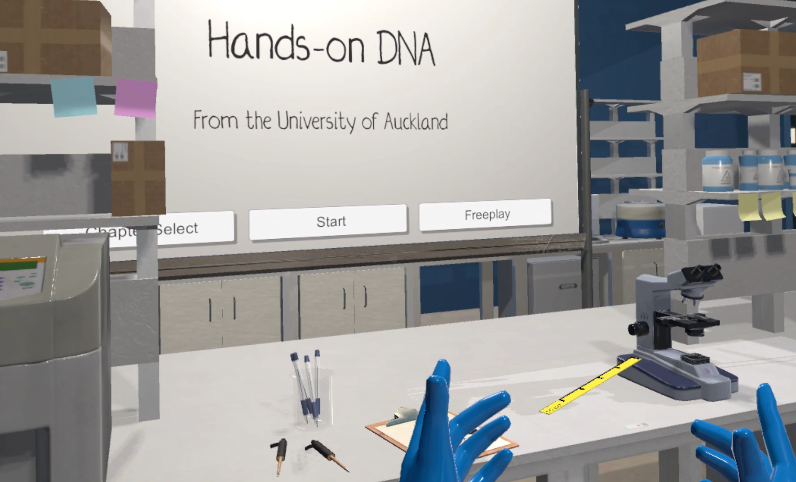
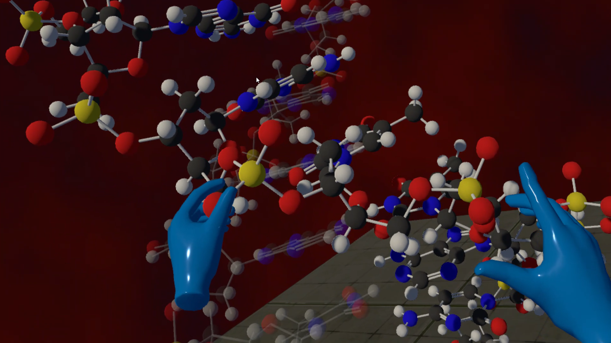

# Hands-On DNA

A learning and outreach tool that uses Virtual Reality to teach about DNA.

Hands-On DNA is a VR learning tool built to teach first year university students about DNA sturcture and scale. 

Designed by Sebastian Dunn and built by Sebastian Dunn, Dominik Lange-Nawka, and Samuel Thompson, this project is distributed under the GNU General Public License v3.0.

This project was Sebastian Dunn's MSc thesis project, supervised by A/Prof Jane Allison of the Allison Group in the School of Biological Sciences and co-supervised by Dr Burkhard W&#x00FC;nsche of the Graphics Group in the School of Computer Sciences, University of Auckland. 
