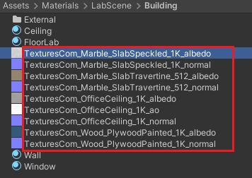

# Hands-On DNA

A learning and outreach tool that teaches about DNA in Virtual Reality.

Explore the Lab            |  Pick up DNA
:-------------------------:|:-------------------------:
  |  

## What is it?
Hands-On DNA is a VR learning experience built to teach Stage 1 university students about DNA. The module uses the unique advantages of VR to help students learn the scale and 3D structure of DNA. The experience takes 20-30 minutes to run through and can be played on any Oculus Rift, HTC Vive, or Oculus Quest (with link cable) headset connected to a VR-ready Windows computer. 

The experience is split into two major scenes:
1. The Lab. The students starts in a laboratory environment where they can explore and pick up objects. When they choose to continue they experience shrinking from normal size down to atomic size. There are stops at 100x and 10,000x scale, before finally the student descends into a cell nucleus on a microscope slide. 
1. The Cell. The student is now in a simple cell environment with a series of scale models of DNA to interact with. There are five learning activities in this scene:
    1. Identifying the different elements that make up DNA
    1. Exploring the different ways we visualise DNA, and why we would use over the other
    1. Breaking apart a DNA strand to discover six major subunits of DNA: phosphates, deoxyribose sugars, and the four nitrogenous bases
    1. Reconstructing a length of four nucleotides out of these six types of subunits
    1. Changing the order of the bases to complement an existing strand of DNA

This project was designed by Sebastian Dunn and developed by him, Dominik Lange-Nawka, and Samuel Thompson. It was developed as part of Sebastian's MSc (Bioinformatics) thesis, supervised by A/Prof Jane Allison of the Allison Group in the School of Biological Sciences and co-supervised by Dr Burkhard W&#x00FC;nsche of the Graphics Group in the School of Computer Sciences, University of Auckland. 

## How to Play

You can download and play Hand-On DNA from [our latest release](https://github.com/VR-Biomolecules/HandsOnDNA/releases/tag/v1.0). There are two different version of Hand-On DNA available.

### Hands-On DNA (Full)
The original experience aimed at Stage 1 tertairy biology students. This version assumes some level of high school chemistry and biology knowledge, takes 20-30 minutes to complete, and includes all 5 leanring exercises in the Cell scene. 

### Hands-On DNA (Abridged)
An outreach version of Hands-On DNA that can be played by anyone. This version assumes no knowledge of chemistry or biology and takes 5-10 minutes to complete. It has the full Lab scene and a shorter version of the Cell scene where players can smash up the DNA with a baseball bat and try to find the subunits in the fastest time. 

## How to Build
The source code of Hands-On DNA is available, but the experience uses assets distributed through the Unity Asset store and some materials we cannot redistribute as raw images. As such, these are not included in this open source repository. 

To build Hands-On DNA exactly from base, you will need to to download the following textures from Texture.com and place them in the shown folder:

https://www.textures.com/download/PBR0216/133205

https://www.textures.com/download/PBR0498/138509

https://www.textures.com/download/PBR0201/133173

And Download and import the following assets (most from the Unity Asset store, but one from free3D.com):

https://assetstore.unity.com/packages/3d/props/clipboard-137662

https://assetstore.unity.com/packages/3d/props/weapons/baseball-bats-pack-102171

https://assetstore.unity.com/packages/3d/props/tools/free-laboratory-pack-123782

https://assetstore.unity.com/packages/tools/gui/vr-user-interfaces-83649

https://assetstore.unity.com/packages/3d/environments/urban/medical-laboratory-pbr-103626

https://assetstore.unity.com/packages/3d/props/electronics/microscope-pbr-103786

https://assetstore.unity.com/packages/tools/particles-effects/quick-outline-115488

https://free3d.com/3d-model/pen-361489.html

## Licence Information
Hands-On DNA, in its standalone Full or Abridged versions, as well as source code, is made available under the [GNU General Public License v3.0](https://github.com/VR-Biomolecules/HandsOnDNA/blob/main/LICENSE). 

Unity tubular is distributed under the [MIT License](https://github.com/mattatz/unity-tubular/blob/master/LICENSE).

Distributed under [CCBY 3.0](https://creativecommons.org/licenses/by/3.0/):
* Bond break - "Pop, Low, A (H1).wav" by InspectorJ (www.jshaw.co.uk) of Freesound.org
* Bond make - “Pop.wav” by yottasounds (https://freesound.org/people/yottasounds/) of Freesound.org 

Distributed under [CCBY-NC 3.0](https://creativecommons.org/licenses/by-nc/3.0/):
* Crowd Cheering - “06684 children hooray joy shout.WAV” by FxProSound (https://www.facebook.com/fxprosound/) accessed via Freesound.org

Distributed under [CCBY-NC 4.0](https://creativecommons.org/licenses/by/4.0/):
* DNA Subunit summary image, modified and accessed from OpenStax.com.
    * Authors: Connie Rye, Robert Wise, Vladimir Jurukovski, Jean DeSaix, Jung Choi, Yael Avissar
    * Publisher/website: OpenStax
    * Book title: Biology
    * Publication date: Oct 21, 2016
    * Location: Houston, Texas
    * Book URL: https://openstax.org/books/biology/pages/1-introduction
    * Section URL: https://openstax.org/books/biology/pages/3-5-nucleic-acids

